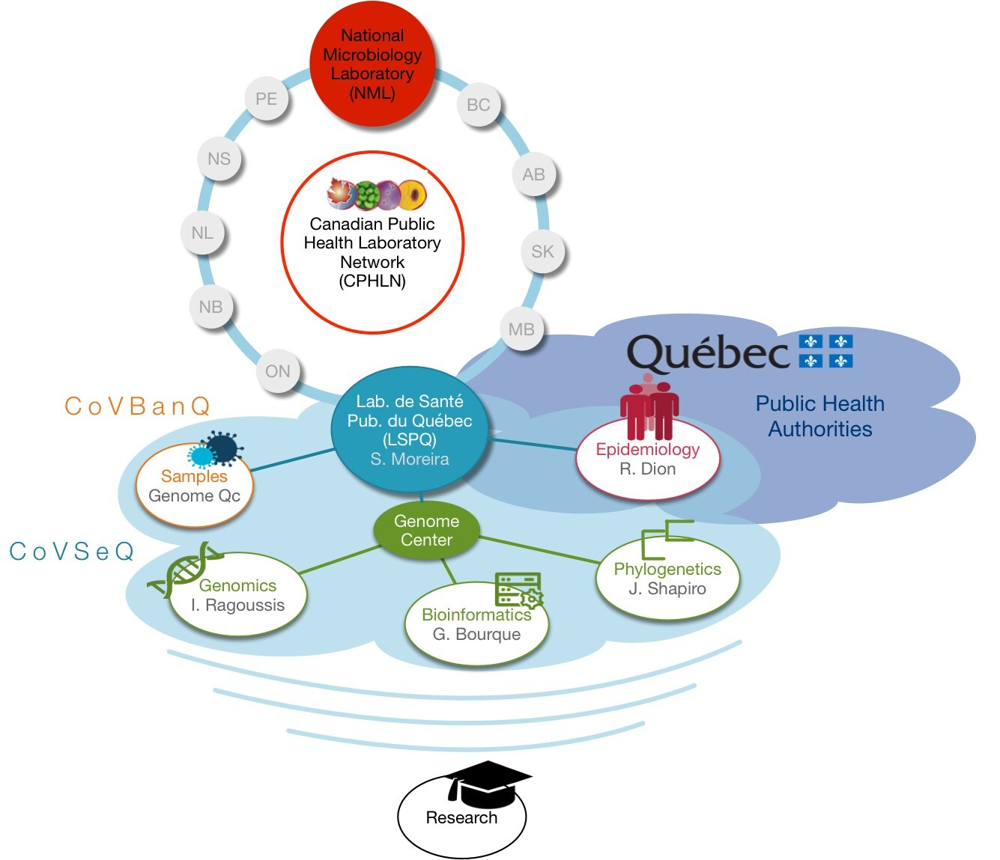

# CoVSeQ

CoVSeQ is the partnership for Québec SARS-CoV-2 sequencing. We receive
funding from the <a name="cancogen" href="https://www.genomecanada.ca/en/news/genome-canada-leads-40-million-genomics-initiative-address-covid-19-pandemic">CanCOGeN initiative through Genome Canada</a>  and from
the Ministere de la santé et des services sociaux du Québec.

### Partners

- [Institut National de Santé Publique (INSPQ)](#inspq)
 - [Laboratoire de Santé Publique du Québec ](#lspq)
 - [Direction des risques biologiques et de la santé au travail (DRBST)](#drbst)
- [Université de Montréal](#udem)
- [McGill Genome Center](#mgc)
- [C3G](#c3g)
- [Calcul Québec](#cq)
- [Université McGill](#umcg)
- [Génome Québec](#gq)

  

## <a name="inspq" href="https://www.inspq.qc.ca/">Institut National de Santé Publique (INSPQ)</a>

  >The <a href="https://www.inspq.qc.ca/"> Institut de Santé Publique du Québec (INSPQ, Public Health Institut of Quebec) </a>
    is a center of expertise and of reference for Public Health in Québec. Our mission is to support Québec’s Minister of Health and Social Services, regional public health authorities, and health and social services institutions in carrying out their public health responsibilities, by offering our expertise and specialized laboratory and screening services. Our objective is to improve the health status and the well being of the population. As a part of INSPQ, the Laboratoire de Santé Publique du Québec (LSPQ, Public
  Health Laboratory of Quebec) is the reference microbiology laboratory of Québec.
  LSPQ performs specialised analyses for the diagnostic and the surveillance of
  infectious diseases.

>  ### <a name="lspq" href="https://www.inspq.qc.ca/lspq"> Public Health Laboratory of Quebec / Laboratoire de Santé Publique du Québec (LSPQ) </a>
  <ul>
  <li> <b>Sandrine Moreira, Head of Genomics and Bioinformatics Lab, Coordinator of CoVSeQ initiative</b> </li>
  <li>  Dr. Michel Roger, Medical director, Coordinator of CoVSeQ initiative </li>
  <li>  Eric Fournier, Bioinformatician, Phylogenetic Analysis</li>
  <li>  Dr. Réjean Dion, Public Health Physician</li>
  <li>  Dr. Hugues Charest, Head of Respiratory Virus departmentDirection</li>
  </ul>

>  ### <a name="drbst" href="https://https://www.inspq.qc.ca">Direction des risques biologiques et de la santé au travail (DRBST)</a>
  <ul>
  <li>
  Christophe Garenc
  </li>
  </ul>

## <a name="udem" href="https://www.umontreal.ca/">Université de Montréal</a>

<ul>
<li>  Michel Roger, professor in the departement of Microbiology</li>
<li>  Sandrine Moreira, associate professor in the department of Biochemistry</li>
<li>  Hugues Charest, professor in the departement of Microbiology</li>
</ul>

## <a name="mgc" href="http://www.mcgillgenomecentre.org/">McGill Genome Center</a>

<ul>
<li>  Prof. Ioannis Ragoussis, Head of Genome Science </li>
<li>  Sarah Reiling, Research associate </li>
<li>  Jesse Shapiro, Assoc. Prof </li>
<li>  Carmen Lia Murall Post Doc </li>
<li>  Prof. Guillaume Bourque, Head of Bioinformatics </li>
</ul>

## <a name="c3g" href="http://www.computationalgenomics.ca/">C3G</a>

<ul>
<li>  Prof. Guillaume Bourque, Director </li>
<li>  Mathieu Bourgey, Bioinformatics manager - Technological development team </li>
<li>  Paul Stretenowich, Bioinformatics consultant </li>
<li>  José-Hector Galvez, Bioinformatics specialist </li>
<li>  Senthilkumar Kailasam, Bioinformatics Consultant</li>
<li>  Pierre-Olivier Quirion, HPC specialist  </li>
<li>  David Bujold, Bioinformatics manager - Data Unit team </li>
<li>  Romain Grégoire, Web Developer  </li>
</ul>

## <a name="cq" href="https://www.calculquebec.ca/">Calcul Québec</a>

<ul>
<li>  Pierre-Olivier Quirion, HPC analyst </li>
</ul>
</ul>

## <a name="gq" href="http://www.genomequebec.com/">Génome Québec</a>

>The Coronavirus Banq of Quebec (CoVBanQ) is a biobank of primary clinical specimen from COVID-19 positives patients collected by
Québec hospitals plus the LSPQ and then hosted by Genome Québec. Specimens collected are mainly aliquots from nasopharyngeal or oropharyngeal swabs, saliva, broncho-alveolar lavage, expectoration, tissues or feces.
