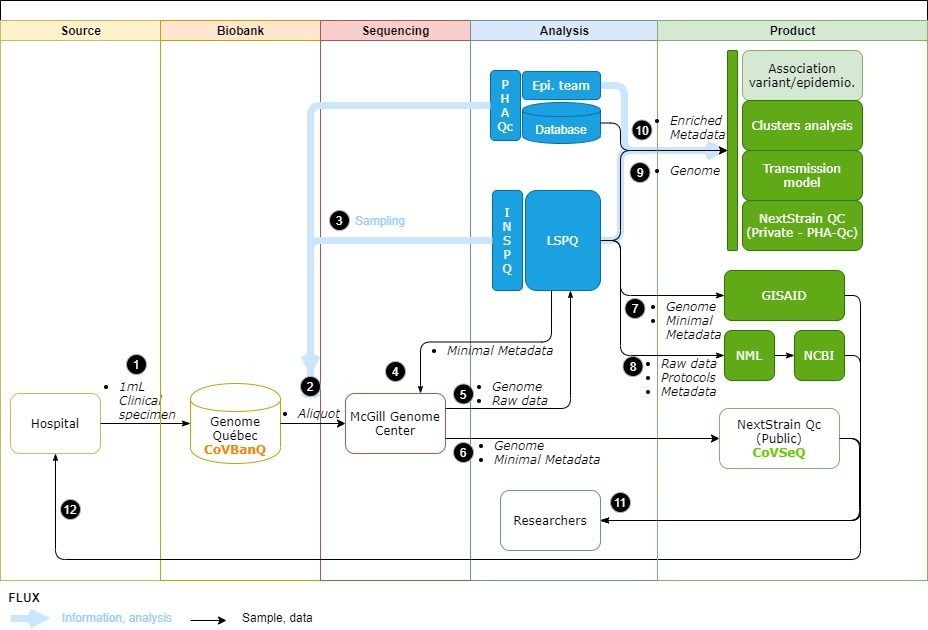

# Methods

Under Construction

#### Table of contents:

 - [Workflow](#workflow)
 - [Sampling strategy](#sampling-strategy)
 - [Sequencing methods](#sequencing-methods)
 - [Bioinformatics methods](#bioinformatics-methods)
 - [Phylogenetic methods](#phylogenetic-methods)
 - [Epidemiological investigations](#epidemiological-investigations)

### Workflow

  

### Sequencing Methods
<ul>
<li>Illumina Protocol.io </li>
<li>MGI protocol.io</li>
<li>Nanopore protocol.io</li>
</ul>

### Bioinformatics

<ul>
<li><a href =”https://c3g.github.io/covseq_McGill/SARS_CoV2_Sequencing/Illumina_overview.html”>Illumina Protocol.io</a> </li>
<li><a href =”https://c3g.github.io/covseq_McGill/SARS_CoV2_Sequencing/MGI_overview.html”>MGI protocol.io</a></li>
<li><a href =”https://c3g.github.io/covseq_McGill/SARS_CoV2_Sequencing/ONT_overview.html”>Nanopore protocol.io</a></li>
</ul>
