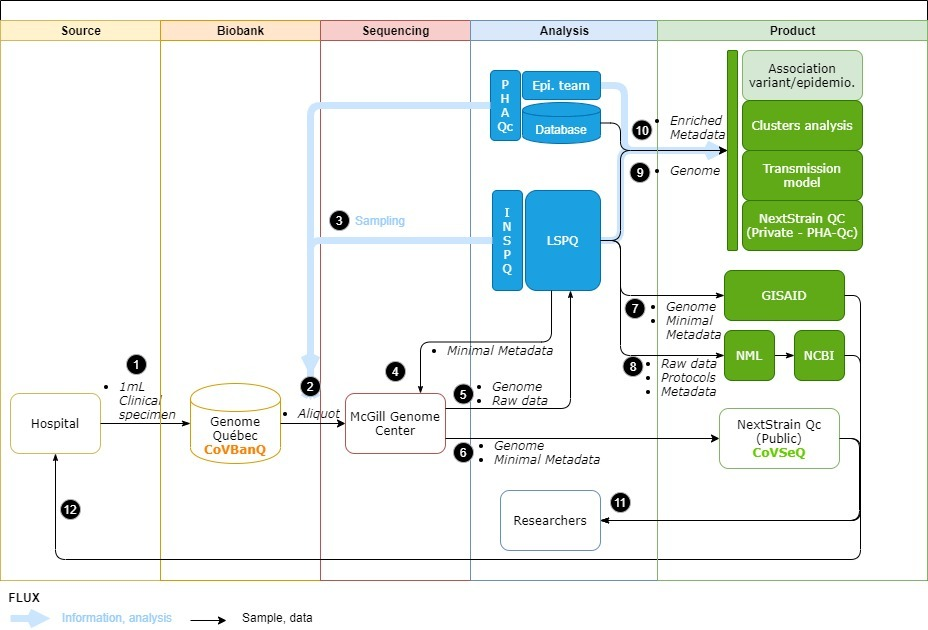

# Méthodes

#### Menu:

 - [Flux d’analyse](#workflow)
 - [Stratégie d’échantillonnage](#sampling-strategy)
 - [Méthodes de séquençage](#sequencing-methods)
 - [Méthodes bioinformatiques](#bioinformatics-methods)

### Flux d’analyse

  

### Méthodes de séquençage

  Dans les rondes d'analyse d'éclosions une librairie Nanopore est préparée et peut contenir jusqu'à 95 échantillons. Pour les analyses à haut débit typique, une librairie Illumina NextFlex est préparée sur la platform NovaSeq où jusqu'à 380 échantillons pour chacunes des deux lignes sont ingérés à chaques ronde.

<ul>
<li> <a name="lunascript" href="https://dx.doi.org/10.17504/protocols.io.bjgekjte">Lunascript RT</a></li>
<li><a name="artic_pcr" href="https://dx.doi.org/10.17504/protocols.io.bj9hkr36">Artic PCR</a> </li>
<li> <a name="nanopore" href="https://dx.doi.org/10.17504/protocols.io.bjkvkkw6">Nanopore libprep</a> </li>
<li><a name="illumina_seq" href="https://dx.doi.org/10.17504/protocols.io.bjgnkjve"> Illumina NextFlex libprep</a> </li>
<li><a name="freeze1" href="https://covseq.ca/data/public_documents/MGI-procedure.pdf">MGI</a></li>
</ul>

### Bio-informatique

<ul>
<li><a name="assem_ill" href="https://c3g.github.io/covseq_McGill/SARS_CoV2_Sequencing/Illumina_overview.html"> Illumina Protocol</a> </li>
<li><a name=assem_mgi href ="https://c3g.github.io/covseq_McGill/SARS_CoV2_Sequencing/MGI_overview.html">MGI protocol</a></li>
<li><a name=assem_nano href ="https://c3g.github.io/covseq_McGill/SARS_CoV2_Sequencing/ONT_overview.html">Nanopore protocol</a></li>
</ul>
